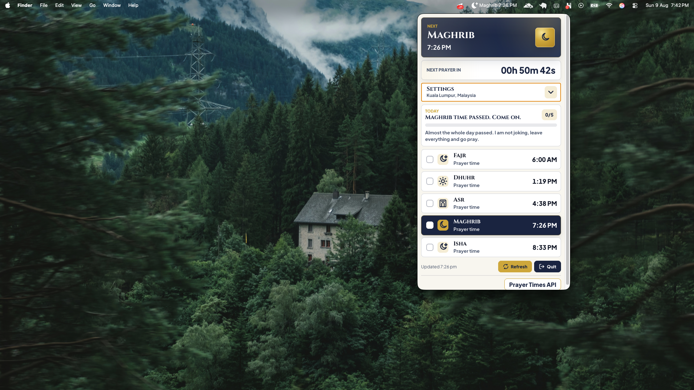
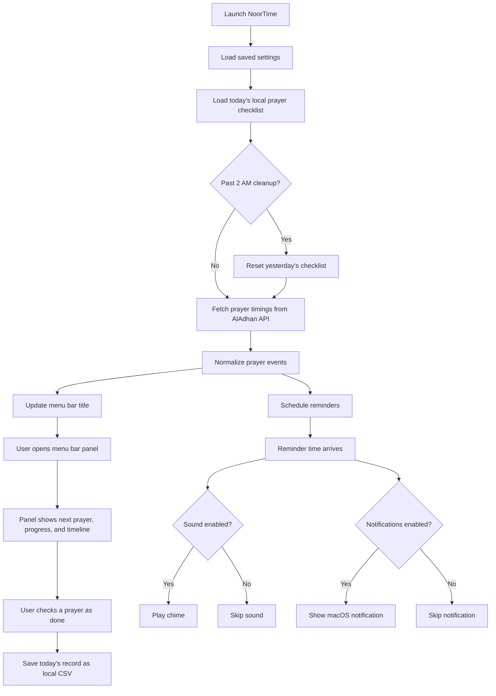

# NoorTime

NoorTime is a lightweight desktop salah timer for the macOS menu bar and Windows system tray. It keeps the next prayer time visible, shows a compact prayer schedule panel, plays a gentle chime, sends local desktop notifications, and lets you mark today's prayers as done before the app gives you a little mom-style nudge.

This project is open source and powered by Backpack.



## Platform Support

| Platform | Status | Notes |
| --- | --- | --- |
| macOS | Supported | Current release ships as a `.dmg` installer for Apple Silicon Macs. |
| Windows | Supported | Windows release ships as an NSIS `.exe` installer. |
| Mobile | Coming soon | Planned mobile experience. |

## What Is This?

NoorTime is built for Muslims who want a simple desktop reminder without keeping a full window open. It runs from the macOS menu bar or Windows system tray, so it stays out of the way and can be opened when needed.

Core features:

- Menu bar/system tray display for the next prayer
- Daily salah timeline
- Today-only prayer checklist with a glowing progress bar
- Playful encouragement and gentle scolding when prayers are missed
- Configurable city, country, timezone, and calculation method
- Optional sound reminders
- Optional desktop notifications
- Test button for checking sound and notification behavior
- In-app Quit button

## Who Is It For?

NoorTime is for:

- Muslims who work on macOS or Windows and want prayer reminders on desktop
- People who prefer a quiet menu bar utility over a full-screen app
- Developers who want a small Electron example for tray apps, local notifications, and packaged desktop apps

## Tech Stack

| Area | Technology | Purpose |
| --- | --- | --- |
| Desktop runtime |  | Builds the menu bar/system tray app |
| Main process |   | Handles tray, windows, timers, notifications, and settings |
| UI |    | Renders the menu bar panel |
| Prayer data |  | Fetches prayer timings by city and country |
| Packaging |  | Creates macOS and Windows installers |
| Storage |   | Saves local app settings and today's prayer record |

## Download For Mac

The current macOS installer is generated at:

[Download NoorTime for macOS](./dist/NoorTime-1.0.0-arm64.dmg)

Install steps:

1. Download or open `dist/NoorTime-1.0.0-arm64.dmg`.
2. Drag **NoorTime** into the **Applications** folder if the DMG window shows that option.
3. Open **NoorTime** from Applications or directly from the mounted DMG.
4. Allow location and notification access when macOS asks.

If macOS blocks the app because it is not from the App Store, open **System Settings > Privacy & Security**, then allow NoorTime from the security message.

## Download For Windows

The Windows installer is generated in `dist/` after running the Windows package command.

Install steps:

1. Open the generated `NoorTime Setup 1.0.0.exe` installer from `dist/`.
2. Follow the installer prompts.
3. Open **NoorTime** from the Start menu.
4. Allow notification and location access when Windows asks.

## Folder Structure

```text
.
├── build/
│   ├── icon.png                 # macOS packaging icon
│   └── icon.ico                 # Windows packaging icon
├── public/
│   └── assets/                  # App, tray, and brand image assets
├── scripts/
│   └── check.js                 # Project and syntax check script
├── src/
│   ├── main.js                  # Electron main process and app logic
│   ├── preload.js               # Safe bridge between UI and main process
│   ├── sound.html               # Hidden chime playback window
│   └── renderer/
│       ├── index.html           # Menu bar panel markup
│       ├── renderer.js          # Panel rendering and UI handlers
│       └── styles.css           # Panel styles
├── .gitignore
├── package.json
└── package-lock.json
```

## App Flow



## Today Prayer Record

The panel includes a tiny daily accountability layer:

- Check a prayer directly from the timeline when it is done.
- Watch the progress bar light up in a calm green as the day improves.
- If a prayer time passes unchecked, NoorTime switches from friendly encouragement to a firmer mom-style reminder.
- After all five are done, the panel winds down with a simple well-done message.

The checklist is deliberately temporary. NoorTime stores it as `today-prayers.csv` in the app's private local storage, then clears it around 2:00 AM so tomorrow starts fresh.

## Getting Started

Install dependencies:

```bash
npm install
```

Run the app locally:

```bash
npm start
```

Run the project check:

```bash
npm run build
```

Package the app for the current platform:

```bash
npm run dist
```

Package the macOS app:

```bash
npm run dist:mac
```

Package the Windows app:

```bash
npm run dist:win
```

Packaged output is generated in `dist/`.

## Scripts

| Command | Description |
| --- | --- |
| `npm start` | Starts NoorTime locally with Electron |
| `npm run build` | Checks required files and JavaScript syntax |
| `npm run lint` | Runs the same project check |
| `npm run dist` | Packages the app for the current platform |
| `npm run dist:mac` | Packages the macOS app |
| `npm run dist:win` | Packages the Windows app |

## Notes

- `build/` is committed because it contains packaging input such as the app icon.
- `dist/` is ignored because it contains generated packaged output.
- NoorTime uses local desktop notifications, not remote push notifications.
- Today's prayer checklist is stored locally as CSV and is wiped after the day ends.
- The packaged app is configured as a macOS menu bar agent, so it does not appear in the Dock.

## License

MIT License. See [LICENSE](./LICENSE).
